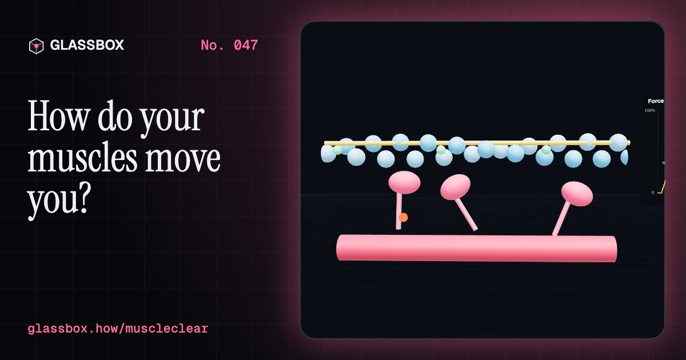
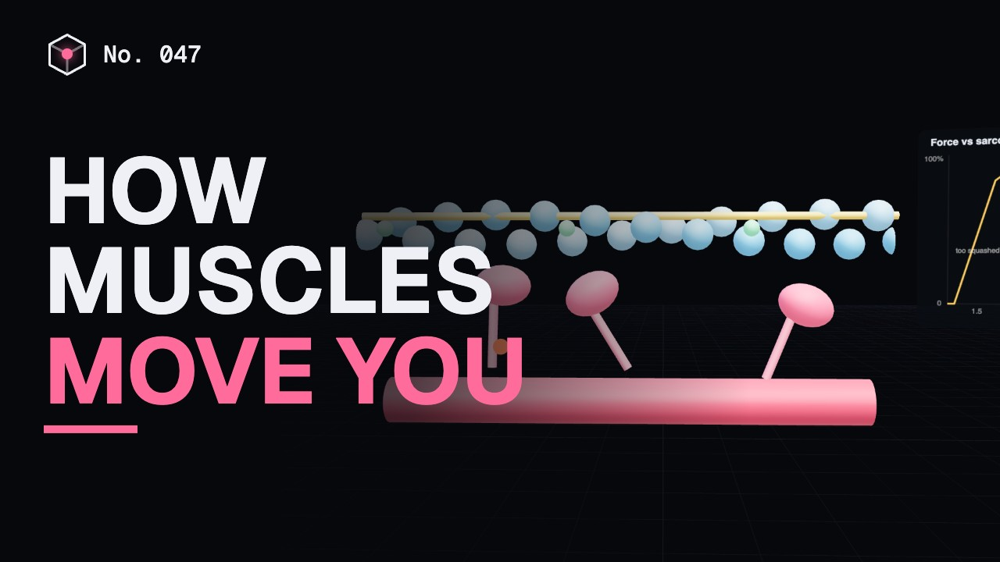
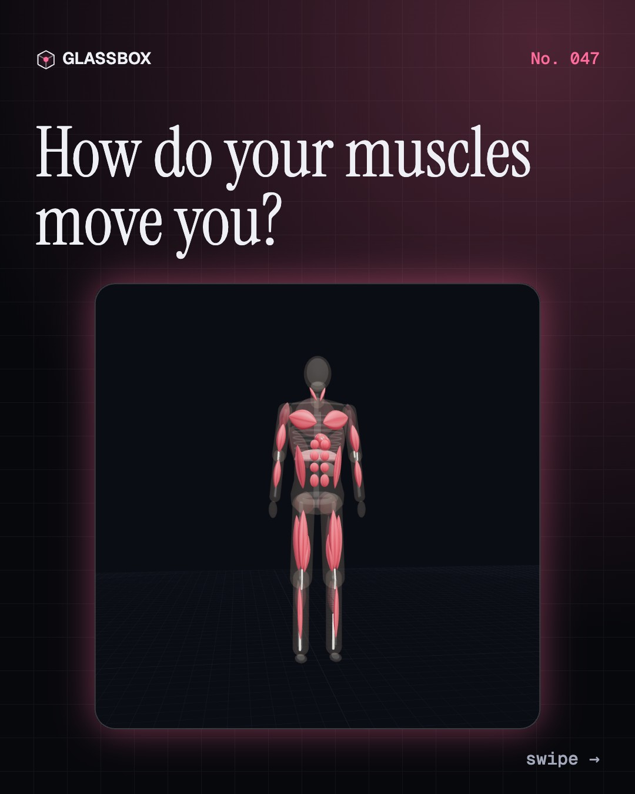
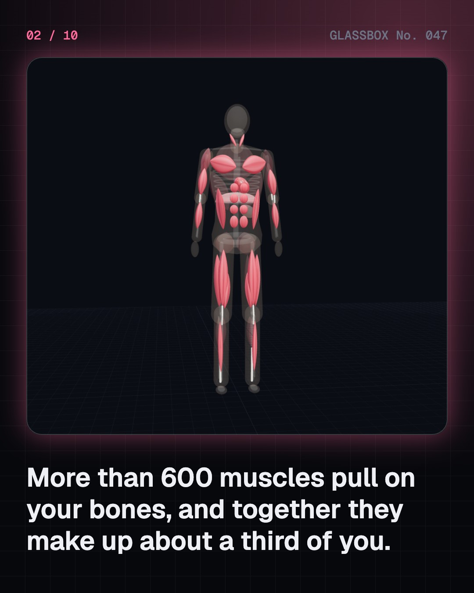
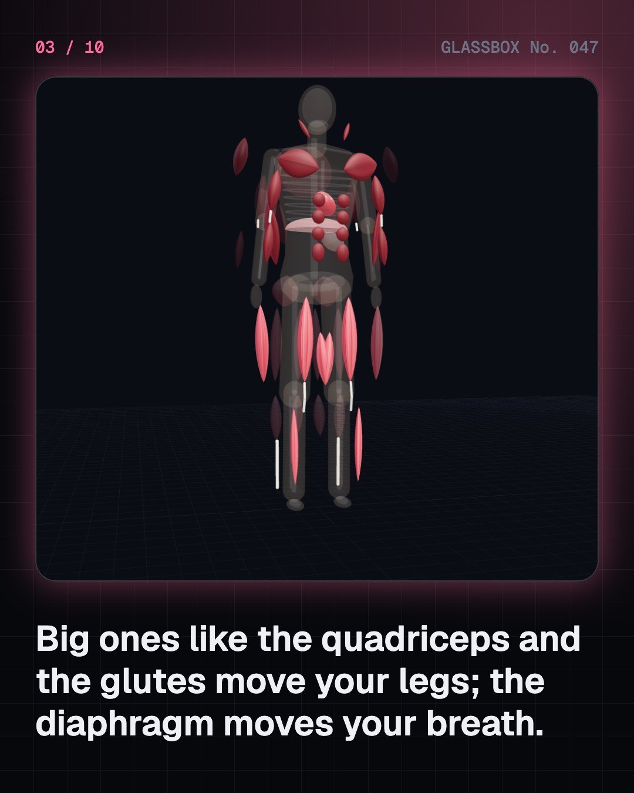
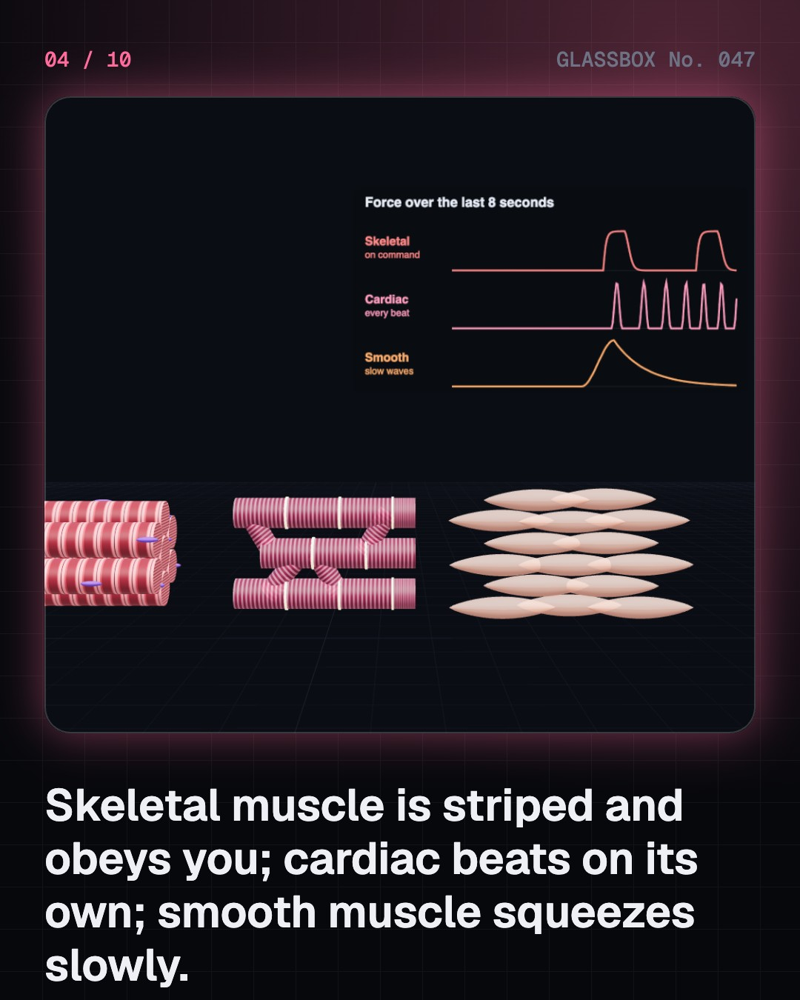

<!-- glassbox:start -->
<!-- Generated from glassbox.json by the Glassbox hub (npm run readme -- muscleclear). Edit glassbox.json, not this block. -->
<p align="center"><a href="https://glassbox-production-fd52.up.railway.app/e/muscleclear/"></a></p>

<h1 align="center">MuscleClear</h1>

<p align="center"><b>How do your muscles move you?</b><br>More than 600 muscles, a third of your body, and every one can only pull. Peel a body down to its muscles, zoom into a sarcomere to watch myosin heads tug on actin with ATP, work out how hard your biceps pulls, and race the three energy systems.</p>

<p align="center"><a href="https://glassbox-production-fd52.up.railway.app/muscleclear/"><b>▶ Play with it</b></a> &nbsp;·&nbsp; <a href="https://glassbox-production-fd52.up.railway.app/e/muscleclear/">Read the 60-second explainer</a> &nbsp;·&nbsp; <a href="https://glassbox-production-fd52.up.railway.app/muscleclear/glassbox/reel.mp4">Watch the 40-second video</a></p>

<p align="center">
  <a href="https://glassbox-production-fd52.up.railway.app/e/muscleclear/"></a>
  <a href="https://glassbox-production-fd52.up.railway.app/e/muscleclear/"></a>
  <a href="LICENSE"></a>
  <a href="LICENSE-CONTENT.md"></a>
  <a href="#privacy"></a>
</p>

## In 60 seconds

1. **More than 600 motors under your skin.** Skeletal muscles are about a third of your body mass, joined to bones by tendons: the deltoid, biceps and triceps, pectorals and abs, glutes, quadriceps, hamstrings and calves. The diaphragm, a dome under the lungs, does most of your breathing.
2. **Three kinds of muscle.** Skeletal muscle is striped and voluntary. Cardiac muscle is striped, branched and runs on its own pacemaker, beating about a lakh times a day without tiring. Smooth muscle in the gut and vessels has no stripes and squeezes slowly for seconds.
3. **Millions of tiny tugs.** A muscle is bundles of fibres, fibres are packed with myofibrils, and myofibrils are chains of 2.5 µm sarcomeres. A nerve signal releases calcium, myosin heads grab actin and pull, one ATP per stroke, and the filaments slide so each sarcomere shortens to about 2.0 µm.
4. **Muscles only pull.** So they work in opposing pairs: biceps and triceps, quadriceps and hamstrings. The biceps grips the forearm about 5 cm from the elbow while your hand is 33 cm away, so it pulls about seven times the weight you hold.
5. **Fuel, fibres and fatigue.** Phosphocreatine lasts about 10 s, glycolysis a minute or two, and aerobic respiration for hours. Sprinters are mostly fast-twitch, marathoners mostly slow-twitch. Lactate doesn't cause next-day soreness, and training thickens fibres rather than adding new ones.
6. **Keeping them strong.** Strains usually heal with rest; see a doctor for a pop or if you can't walk. After 30, muscle falls about 3–8% a decade, but strength training twice a week (WHO) and enough protein help at any age.

## Words worth knowing

| Term | Meaning |
|---|---|
| **Skeletal muscle** | Striped, voluntary muscle joined to bones by tendons. |
| **Tendon** | A tough cord of collagen that joins a muscle to a bone. |
| **Sarcomere** | The repeating unit of a muscle fibre, about 2–2.5 µm long, from one Z-disc to the next. |
| **Actin and myosin** | The thin and thick filaments; myosin heads pull on actin to make the filaments slide. |
| **Cross-bridge cycle** | Grab, pull, release, re-cock: one ATP per stroke for each myosin head. |
| **Antagonist pair** | Two muscles that pull a joint opposite ways, like biceps and triceps. |
| **ATP** | The energy molecule every muscle stroke spends, remade by phosphocreatine, glycolysis and aerobic respiration. |
| **Slow- and fast-twitch fibres** | Type I fibres are steady and tireless; type II are quick and powerful but tire fast. |
| **Sarcopenia** | Loss of muscle mass and strength with age. |

## A short history

**From Galen's pairs and Borelli's levers to a frog in a syringe and two papers that changed biology on the same day.**

- **170** · Galen: every muscle has an opposite (Galen of Pergamon, Rome)
- **1543** · The muscle men of the Fabrica (Andreas Vesalius, Padua and Basel)
- **1663** · The frog muscle that did not swell (Jan Swammerdam, Amsterdam)
- **1680** · Borelli: the body is a machine of levers (Giovanni Alfonso Borelli, Rome)
- **1791** · Frog legs twitch with electricity (Luigi Galvani, with Lucia Galeazzi Galvani, Bologna)
- **1922** · A Nobel Prize for muscle heat (Archibald Vivian Hill and Otto Meyerhof, London and Kiel)
- **1927** · Phosphocreatine and ATP are found (Cyrus Fiske and Yellapragada Subbarow (and independently Karl Lohmann, and Philip and Grace Eggleton), Boston)
- **1942** · Threads of actomyosin contract (Albert Szent-Györgyi, Brunó Straub and Ilona Banga, Szeged)

The full story, with 30 moments, charts, people and 56 sources: [glassbox.how/e/muscleclear/history](https://glassbox-production-fd52.up.railway.app/e/muscleclear/history/). The data lives in [`history.json`](history.json).

## Video and slides

Made with the Glassbox studio from this box's storyboard (`window.glassbox.director`). Free to reuse under CC BY 4.0.

<a href="https://glassbox-production-fd52.up.railway.app/muscleclear/glassbox/video.mp4"></a>

<p><a href="glassbox/slide-1.jpg"></a> <a href="glassbox/slide-2.jpg"></a> <a href="glassbox/slide-3.jpg"></a> <a href="glassbox/slide-4.jpg"></a></p>

| File | What | Size |
|---|---|---|
| [`glassbox/reel.mp4`](https://glassbox-production-fd52.up.railway.app/muscleclear/glassbox/reel.mp4) | Reel / Short, with captions and soundtrack | 1080×1920 |
| [`glassbox/video.mp4`](https://glassbox-production-fd52.up.railway.app/muscleclear/glassbox/video.mp4) | YouTube video, with captions and soundtrack | 1920×1080 |
| `glassbox/slide-1…10.jpg` | Instagram carousel | 1080×1350 |
| `glassbox/thumb.jpg` | YouTube thumbnail | 1280×720 |
| `glassbox/cover.jpg` | Share card and repo social preview | 1200×630 |
| [`glassbox/history-reel.mp4`](https://glassbox-production-fd52.up.railway.app/muscleclear/glassbox/history-reel.mp4) | “History in 10 moments” Reel / Short | 1080×1920 |
| `glassbox/history-slide-*.jpg` | History carousel | 1080×1350 |
| `glassbox/post.json` | Post copy and schedule used by the publish kit | |

## Privacy

This box has no accounts and no ads, and it ships its own fonts and libraries. When you run it yourself it sends nothing anywhere. On glassbox.how, the site's `/bar.js` also loads Glassbox's analytics: **Google Analytics** to count visits (it asks first in the EU, UK and Switzerland, and stays off when your browser sends Global Privacy Control or Do Not Track) and **ClickTrust** to detect bots.

It remembers a few things **in your own browser only**, and never sends them anywhere:

| Browser storage key | What it holds |
|---|---|
| `muscleclear.v1` | Which chapters you have opened, your best quiz scores, and sound on or off. |

Exactly what each one sees is at [glassbox.how/privacy](https://glassbox-production-fd52.up.railway.app/privacy/).

## Licences

- **Code:** [MIT](LICENSE). Use it, change it, ship it.
- **Explanations, text, images and videos** (`glassbox.json`, `glassbox/`): [CC BY 4.0](LICENSE-CONTENT.md). Credit “Glassbox, glassbox.how/e/muscleclear”.
- **Third-party parts** keep their own licences: [three.js](https://threejs.org) (MIT), [Geist, Instrument Serif](https://openfontlicense.org) (SIL OFL 1.1).
- The Glassbox name and logo aren't covered by either licence. See the [terms](https://glassbox-production-fd52.up.railway.app/terms/).

Found a mistake? [Open an issue](https://github.com/bdeeps/muscleclear/issues). Corrections happen in public.
<!-- glassbox:end -->

## Run it

It's plain HTML, CSS and JavaScript. No build step and no dependencies. Run locally, it contacts no other website.

```bash
python3 -m http.server 8000
```

Three.js and the fonts ship in `vendor/` and `fonts/`, so it also works offline.

Then open http://localhost:8000.

## How it's built

| File | What |
|---|---|
| `index.html`, `css/app.css` | The page and its styles |
| `js/app.js`, `js/stage.js`, `js/ui.js`, `js/kit.js` | The shared Glassbox 3D engine: chapters, 3D stage, controls, quiz, video director |
| `js/muscle.js` | The ghosted body with its muscles and bones, plus the shared physiology: length–tension curve, energy systems, fibre types, the forearm lever and muscle loss with age |
| `js/chapters/*.js` | One file per chapter: the 3D model, controls, text, key terms, quiz and video scenes |
| `glassbox.json` | Title, question, explainer beats, key terms, browser storage and credits shown on glassbox.how |
| `reel` in each chapter | The storyboard the Glassbox studio records into short videos |
| `glassbox/` | The published video, slides, thumbnail and post copy |
| `fonts/`, `vendor/three/` | Self-hosted Geist and Instrument Serif (SIL OFL 1.1) and three.js (MIT) |
